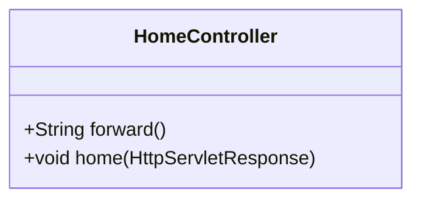
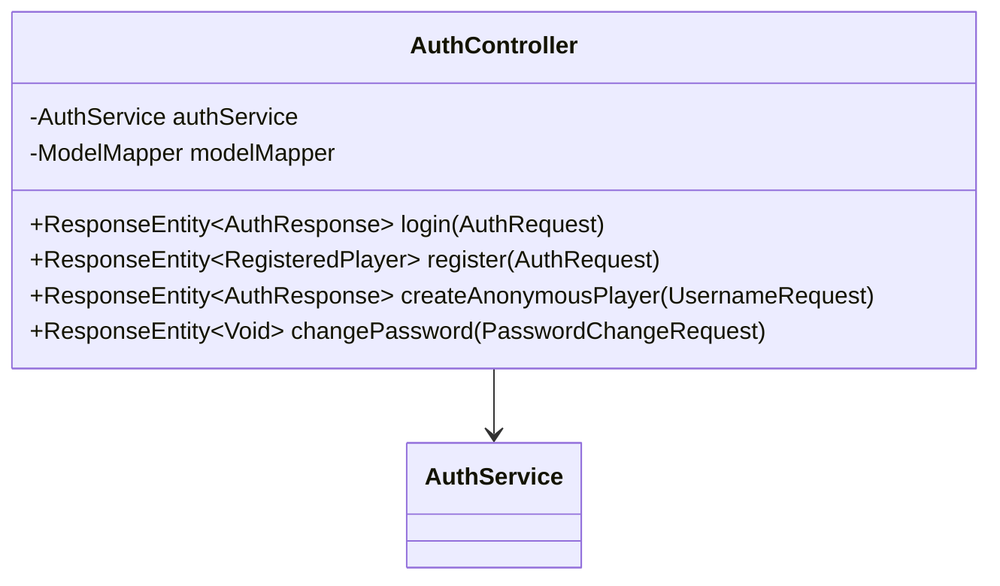
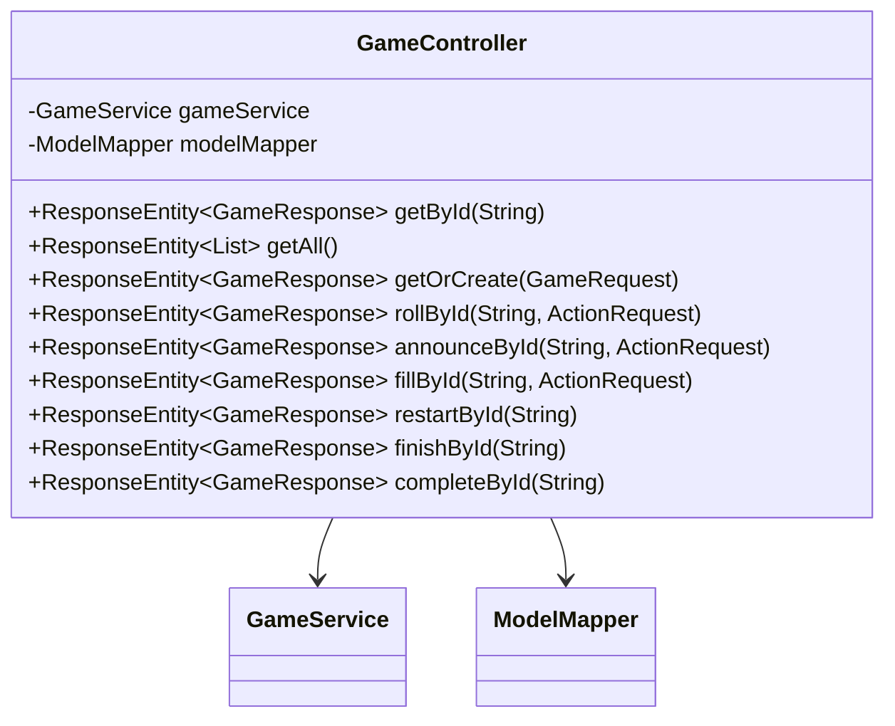
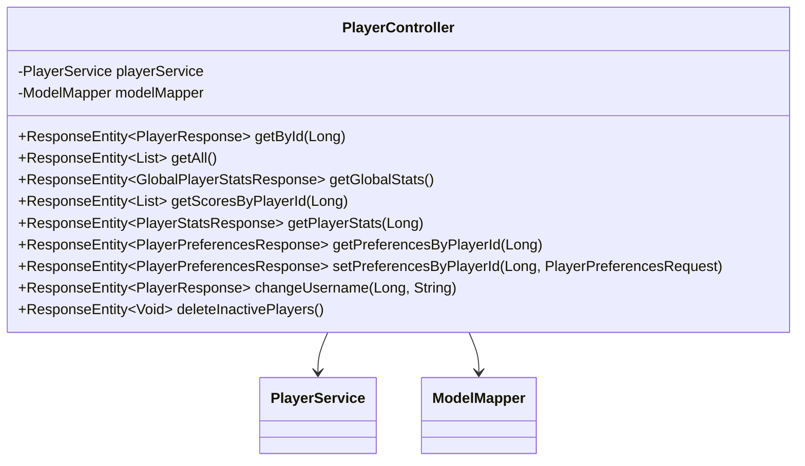
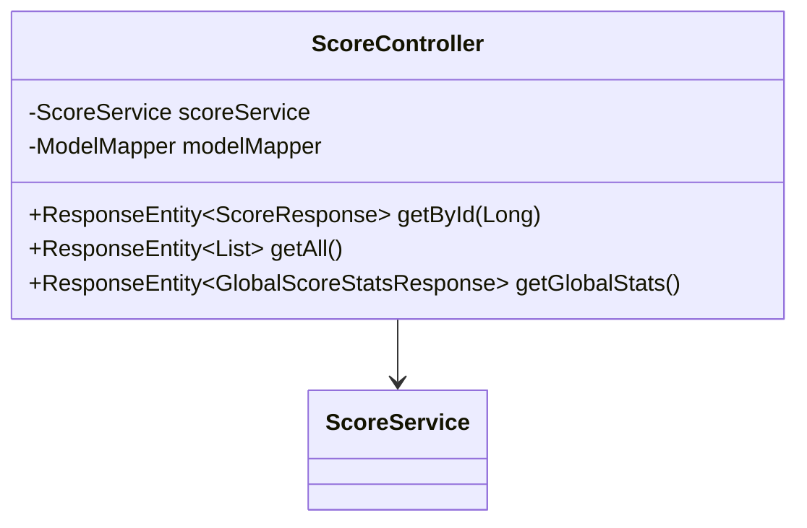
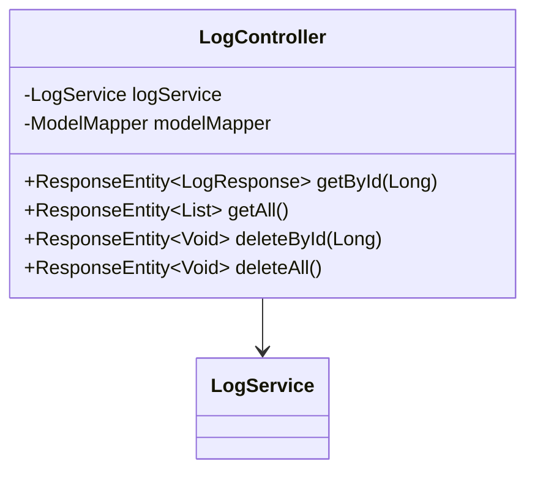

# [ 5. Class Documentation ](../documentation.md)

## 5.3 API

### 5.3.1 Controllers

#### HomeController

Provides basic navigation endpoints.

##### HomeController Class Diagram

##### HomeController Methods
| Method                                | Return Type           | Description                                |
|---------------------------------------|-----------------------|--------------------------------------------|
| `forward()`                           | `String`              | Forwards requests to specific routes.      |
| `home(HttpServletResponse)`           | `void`                | Handles the home page request.             |

---

#### AuthController

Manages authentication and user registration.

##### AuthController Class Diagram

##### AuthController Methods

| Method                                         | Return Type                     | Description                                                        |
|------------------------------------------------|----------------------------------|--------------------------------------------------------------------|
| `login(AuthRequest)`                           | `ResponseEntity<AuthResponse>`   | Authenticates a user and returns an authentication response.        |
| `register(AuthRequest)`                        | `ResponseEntity<RegisteredPlayer>`| Registers a new player.                                             |
| `createAnonymousPlayer(UsernameRequest)`       | `ResponseEntity<AuthResponse>`   | Registers an anonymous player.                                      |
| `changePassword(PasswordChangeRequest)`        | `ResponseEntity<Void>`           | Allows users to change their passwords.                             |

---

#### GameController

Manages game sessions and game actions.

##### GameController Class Diagram

##### GameController Methods

| Method                                         | Return Type                     | Description                                                        |
|------------------------------------------------|----------------------------------|--------------------------------------------------------------------|
| `getById(String id)`                           | `ResponseEntity<GameResponse>`   | Retrieves a game by its ID.                                         |
| `getAll()`                                     | `ResponseEntity<List<GameResponse>>`| Returns a list of all games.                                        |
| `getOrCreate(GameRequest request)`             | `ResponseEntity<GameResponse>`   | Retrieves or creates a new game session.                            |
| `rollById(String id, ActionRequest request)`    | `ResponseEntity<GameResponse>`   | Performs a roll action in a game.                                   |
| `announceById(String id, ActionRequest request)`| `ResponseEntity<GameResponse>`   | Handles announcing actions in a game.                               |
| `fillById(String id, ActionRequest request)`    | `ResponseEntity<GameResponse>`   | Fills a game action based on a request.                             |
| `restartById(String id)`                       | `ResponseEntity<GameResponse>`   | Restarts a game by its ID.                                          |
| `finishById(String id)`                        | `ResponseEntity<GameResponse>`   | Marks a game as finished.                                           |
| `completeById(String id)`                      | `ResponseEntity<GameResponse>`   | Completes a game.                                                   |

---

#### PlayerController

Handles player management and preferences.

##### PlayerController Class Diagram

##### PlayerController Methods

| Method                                                   | Return Type                              | Description                                                      |
|----------------------------------------------------------|-----------------------------------------|------------------------------------------------------------------|
| `getById(Long id)`                                       | `ResponseEntity<PlayerResponse>`        | Retrieves a player by their ID.                                   |
| `getAll()`                                               | `ResponseEntity<List<PlayerResponse>>`  | Returns a list of all players.                                    |
| `getGlobalStats()`                                       | `ResponseEntity<GlobalPlayerStatsResponse>` | Returns global player statistics.                                 |
| `getScoresByPlayerId(Long playerId)`                     | `ResponseEntity<List<ScoreResponse>>`   | Retrieves a list of scores for a specific player.                 |
| `getPlayerStats(Long playerId)`                          | `ResponseEntity<PlayerStatsResponse>`   | Retrieves individual player statistics.                           |
| `getPreferencesByPlayerId(Long playerId)`                | `ResponseEntity<PlayerPreferencesResponse>`| Retrieves a player's preferences by their ID.                    |
| `setPreferencesByPlayerId(Long playerId, PlayerPreferencesRequest request)` | `ResponseEntity<PlayerPreferencesResponse>` | Updates a player's preferences.                                   |
| `changeUsername(Long playerId, String username)`         | `ResponseEntity<PlayerResponse>`        | Changes the username for a specific player.                       |
| `deleteInactivePlayers()`                                | `ResponseEntity<Void>`                  | Deletes players who are inactive for a specified time.            |

---

#### ScoreController

Handles score-related operations.

##### ScoreController Class Diagram

##### Score Controller Methods

| Method                                | Return Type                              | Description                                                      |
|---------------------------------------|------------------------------------------|------------------------------------------------------------------|
| `getById(Long id)`                    | `ResponseEntity<ScoreResponse>`          | Retrieves a score by its ID.                                      |
| `getAll()`                            | `ResponseEntity<List<ScoreResponse>>`    | Returns a list of all scores.                                     |
| `getGlobalStats()`                    | `ResponseEntity<GlobalScoreStatsResponse>`| Retrieves global score statistics.                                |

---

#### LogController
Manages system logging.

##### LogController Class Diagram

##### LogController Methods

| Method                                | Return Type                              | Description                                                      |
|---------------------------------------|------------------------------------------|------------------------------------------------------------------|
| `getById(Long id)`                    | `ResponseEntity<LogResponse>`            | Retrieves a log by its ID.                                        |
| `getAll()`                            | `ResponseEntity<List<LogResponse>>`      | Returns a list of all logs.                                       |
| `deleteById(Long id)`                 | `ResponseEntity<Void>`                   | Deletes a log by its ID.                                          |
| `deleteAll()`                         | `ResponseEntity<Void>`                   | Deletes all logs.                                                 |

