# [ 5. Class Documentation ](../documentation)

## 5.3 API

### 5.3.3 Response DTOs

#### AuthResponse

##### AuthResponse Class Diagram

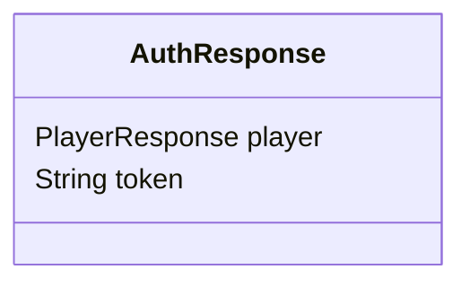

##### AuthResponse Attributes

| Attribute     | Type              | Description                          |
|---------------|-------------------|--------------------------------------|
| `player`      | `PlayerResponse`   | The player information.              |
| `token`       | `String`          | The authentication token.            |

---

#### GameReponse
##### GameReponse Class Diagram

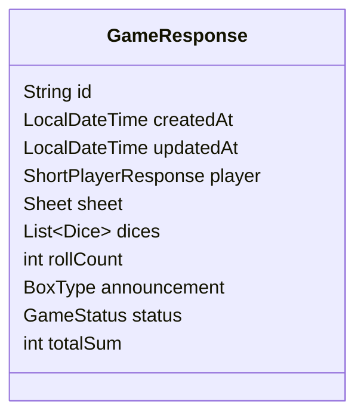

##### GameReponse Attributes

| Attribute     | Type                    | Description                          |
|---------------|-------------------------|--------------------------------------|
| `id`          | `String`                | The unique identifier for the game.  |
| `createdAt`   | `LocalDateTime`         | The timestamp when the game was created. |
| `updatedAt`   | `LocalDateTime`         | The timestamp when the game was last updated. |
| `player`      | `ShortPlayerResponse`   | Information about the player.        |
| `sheet`       | `Sheet`                 | The game sheet.                      |
| `dices`       | `List<Dice>`            | The list of dice used in the game.   |
| `rollCount`   | `int`                   | The number of times the dice have been rolled. |
| `announcement`| `BoxType`               | The type of box announced, if any.   |
| `status`      | `GameStatus`            | The current status of the game.      |
| `totalSum`    | `int`                   | The total score of the game.         |

---

#### PlayerResponse
##### PlayerResponse Class Diagram

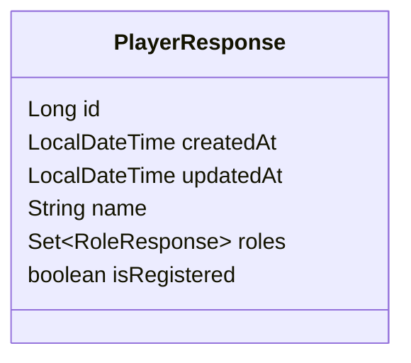

##### PlayerResponse Attributes

| Attribute     | Type                    | Description                          |
|---------------|-------------------------|--------------------------------------|
| `id`          | `Long`                  | The unique identifier for the player.|
| `createdAt`   | `LocalDateTime`         | The timestamp when the player was created. |
| `updatedAt`   | `LocalDateTime`         | The timestamp when the player was last updated. |
| `name`        | `String`                | The name of the player.              |
| `roles`       | `Set<RoleResponse>`     | The roles assigned to the player.    |
| `isRegistered`| `boolean`               | Whether the player is registered.    |

---

#### ScoreResponse
##### ScoreResponse Class Diagram

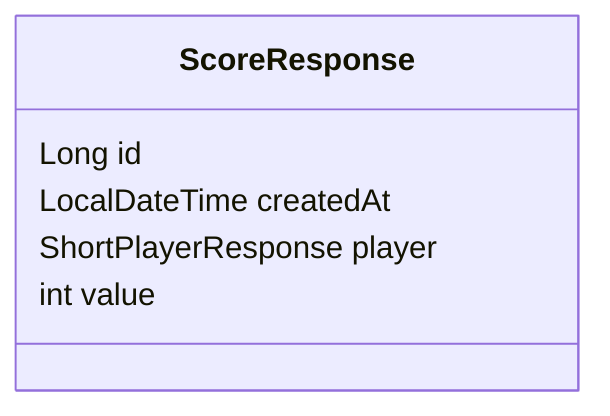

##### ScoreResponse Attributes

| Attribute     | Type                    | Description                          |
|---------------|-------------------------|--------------------------------------|
| `id`          | `Long`                  | The unique identifier for the score. |
| `createdAt`   | `LocalDateTime`         | The timestamp when the score was created. |
| `player`      | `ShortPlayerResponse`   | Information about the player who earned the score. |
| `value`       | `int`                   | The value of the score.              |

---

#### LogResponse
##### LogResponse Class Diagram

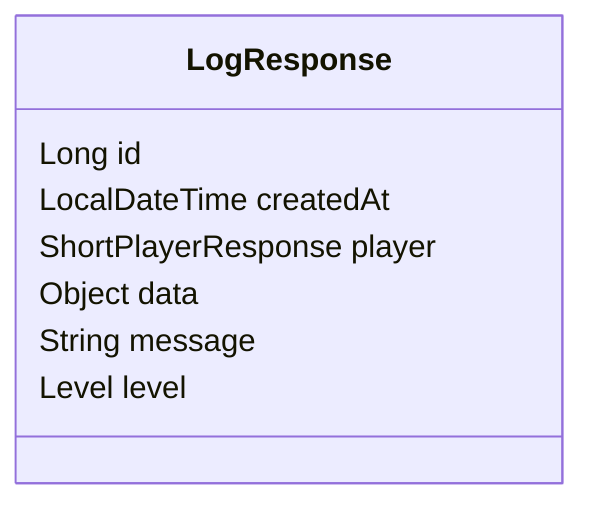

##### LogResponse Attributes

| Attribute     | Type                    | Description                          |
|---------------|-------------------------|--------------------------------------|
| `id`          | `Long`                  | The unique identifier for the log.   |
| `createdAt`   | `LocalDateTime`         | The timestamp when the log was created. |
| `player`      | `ShortPlayerResponse`   | Information about the player associated with the log. |
| `data`        | `Object`                | Additional data related to the log.  |
| `message`     | `String`                | The log message.                     |
| `level`       | `Level`                 | The log level (e.g., INFO, ERROR).   |

---

#### RoleResponse
##### RoleResponse Class Diagram

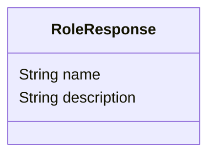

##### RoleResponse Attributes

| Attribute     | Type              | Description                          |
|---------------|-------------------|--------------------------------------|
| `name`        | `String`          | The name of the role.                |
| `description` | `String`          | A description of the role.           |

---

#### PlayerPreferencesResponse
##### PlayerPreferencesResponse Class Diagram

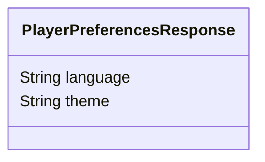

##### PlayerPreferencesResponse Attributes

| Attribute     | Type              | Description                          |
|---------------|-------------------|--------------------------------------|
| `language`    | `String`          | The preferred language of the player.|
| `theme`       | `String`          | The theme preference of the player.  |

---

#### ShortGameResponse
##### ShortGameResponse Class Diagram

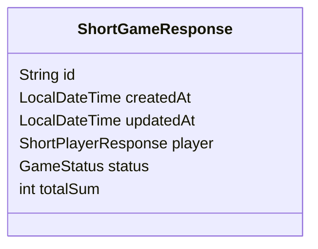

##### ShortGameResponse Attributes

| Attribute     | Type                    | Description                          |
|---------------|-------------------------|--------------------------------------|
| `id`          | `String`                | The unique identifier for the game.  |
| `createdAt`   | `LocalDateTime`         | The timestamp when the game was created. |
| `updatedAt`   | `LocalDateTime`         | The timestamp when the game was last updated. |
| `player`      | `ShortPlayerResponse`   | Information about the player.        |
| `status`      | `GameStatus`            | The current status of the game.      |
| `totalSum`    | `int`                   | The total score of the game.         |

---

#### ShortPlayerResponse
##### ShortPlayerResponse Class Diagram

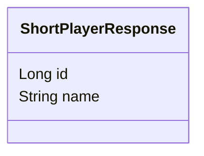

##### ShortPlayerResponse Attributes

| Attribute     | Type              | Description                          |
|---------------|-------------------|--------------------------------------|
| `id`          | `Long`            | The unique identifier for the player.|
| `name`        | `String`          | The name of the player.              |

---

#### ShortScoreResponse
##### ShortScoreResponse Class Diagram

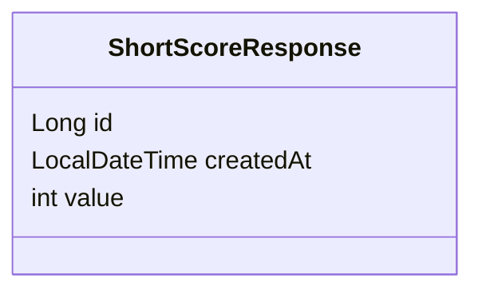

##### ShortScoreResponse Attributes

---

#### ErrorResponse
##### ErrorResponse Class Diagram

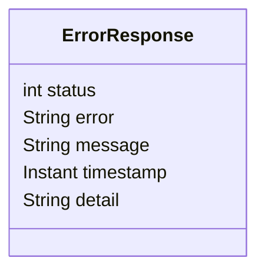

##### ErrorResponse Attributes

| Attribute     | Type              | Description                          |
|---------------|-------------------|--------------------------------------|
| `status`      | `int`             | The HTTP status code.                |
| `error`       | `String`          | The error description.               |
| `message`     | `String`          | The error message.                   |
| `timestamp`   | `Instant`         | The timestamp of the error occurrence.|
| `detail`      | `String`          | Additional details about the error.  |

