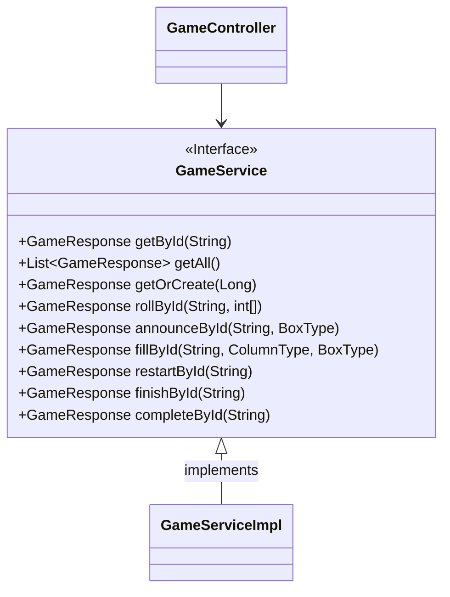
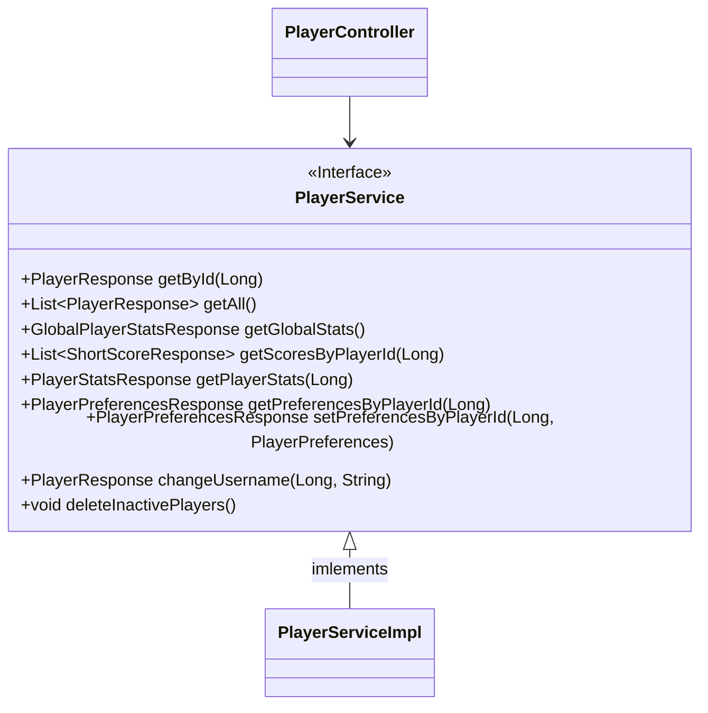
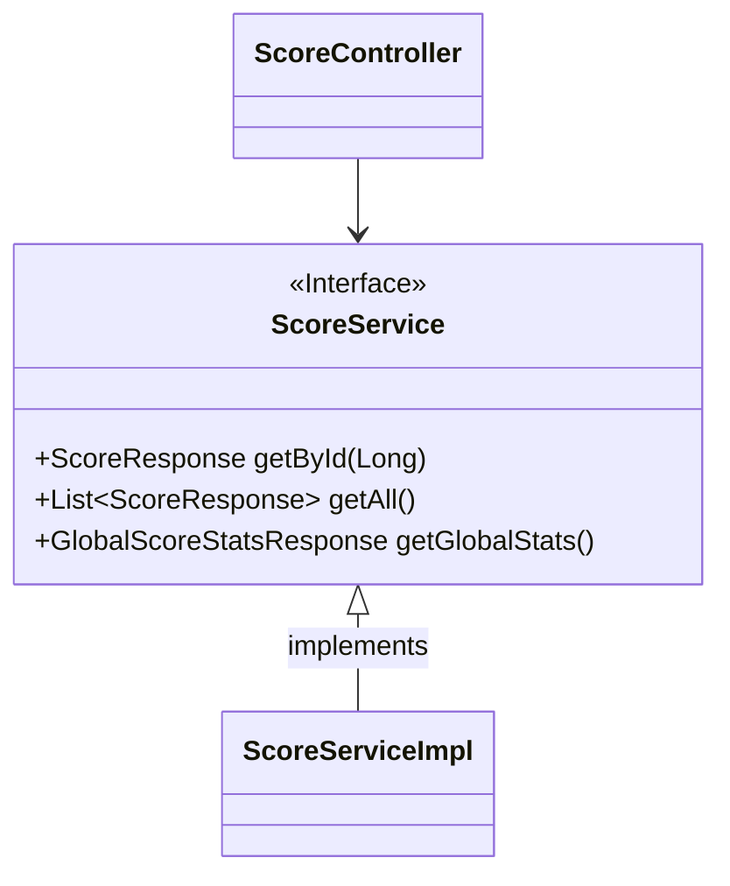
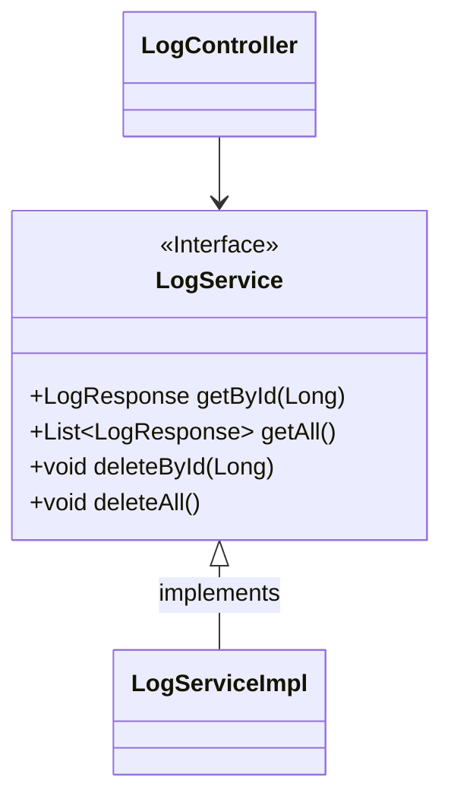
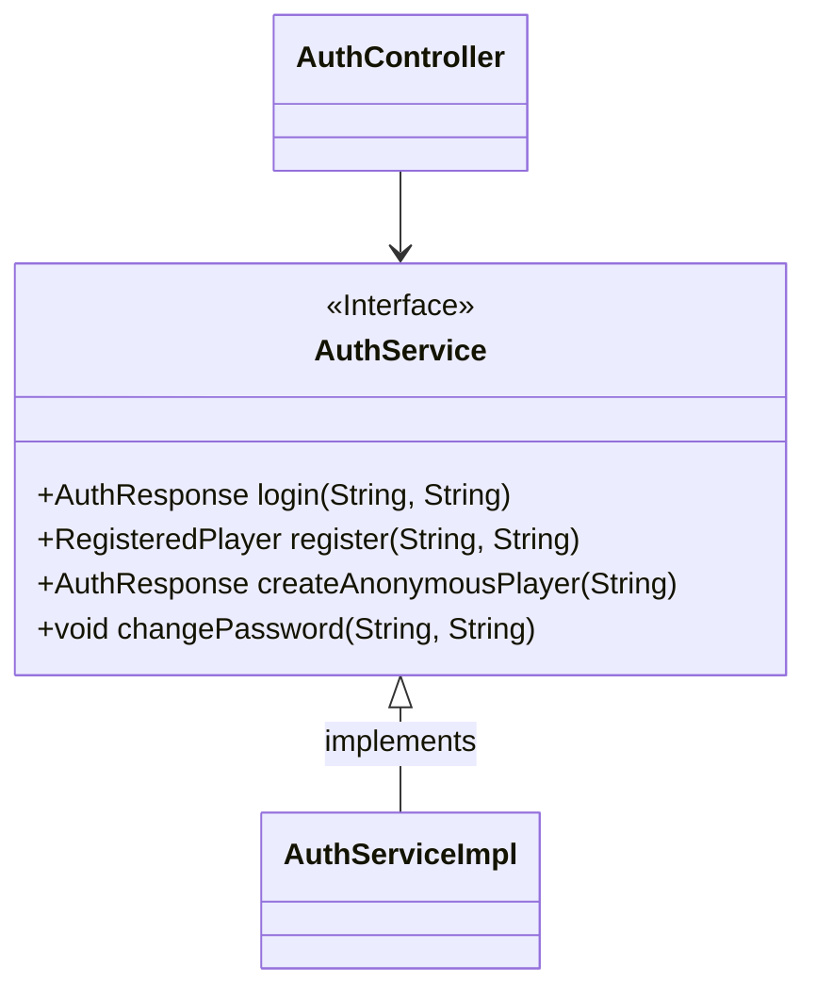
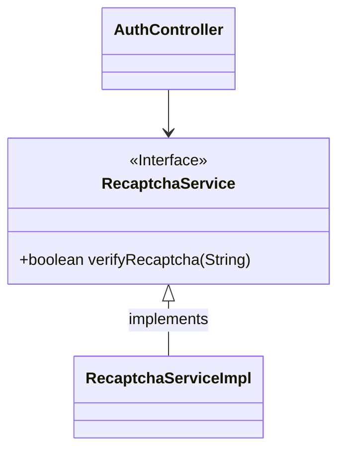

# [ 5. Class Documentation ](../documentation.md)

## 5.2 Business

### 5.2.1 Interfaces

#### GameService

##### GameService Class Diagram

---

#### PlayerService

##### PlayerService Class Diagram

---

#### ScoreService

##### ScoreService Class Diagram

---

#### LogService

##### LogService Class Diagram

---

#### AuthService

##### AuthService Class Diagram

---

#### RecaptchaService

##### RecaptchaService Class Diagram

