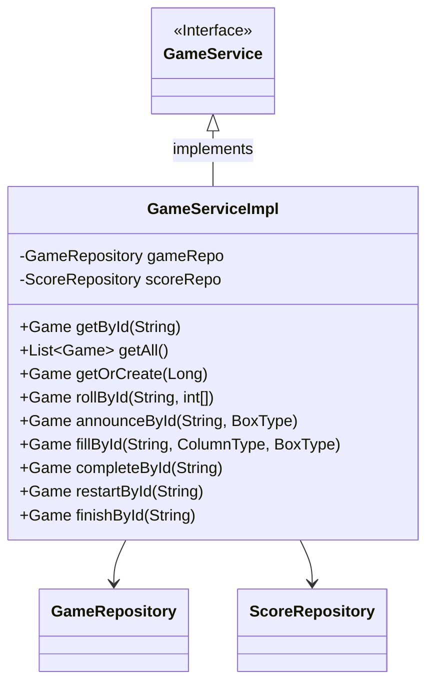
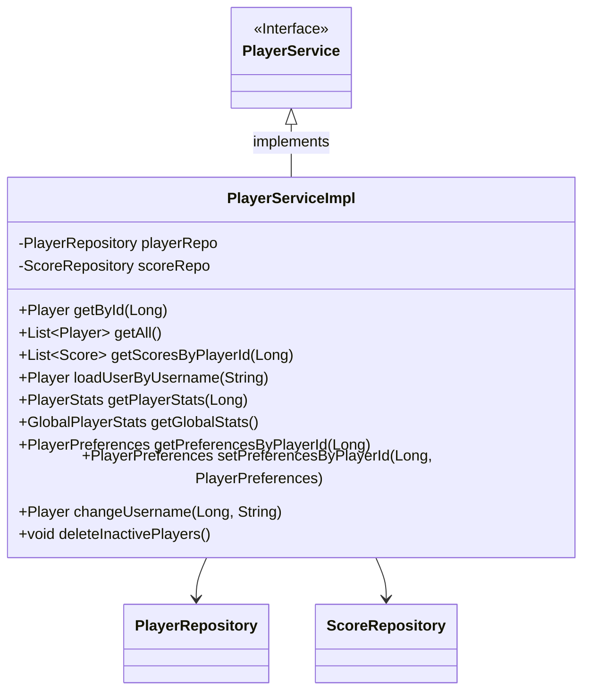
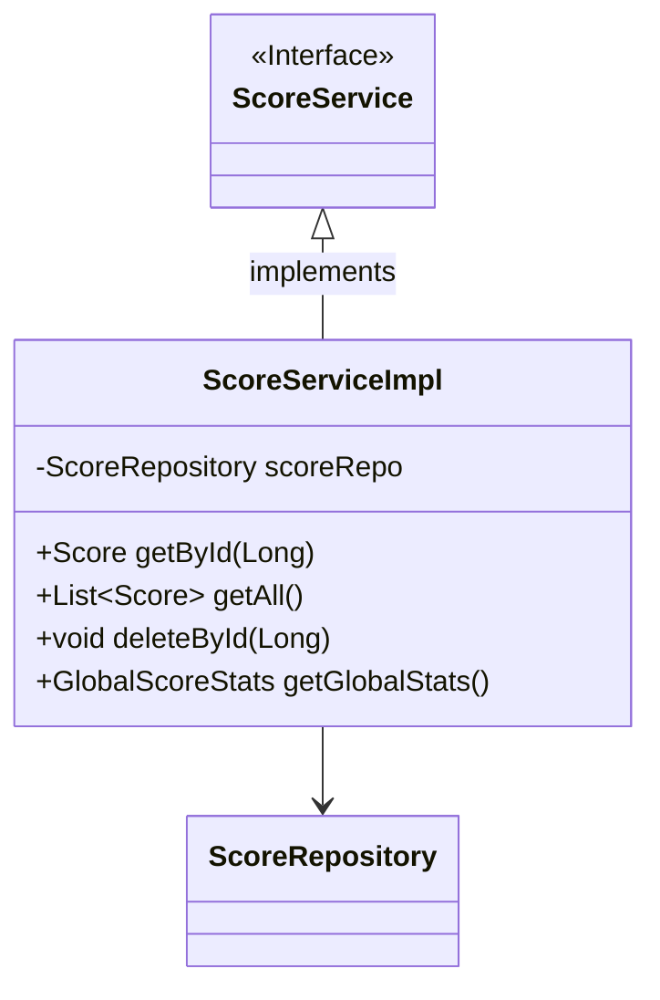
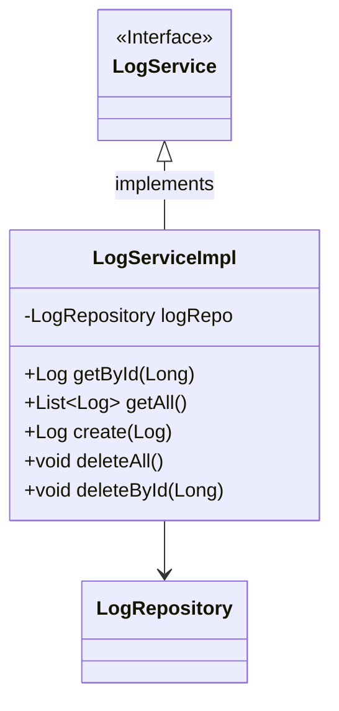
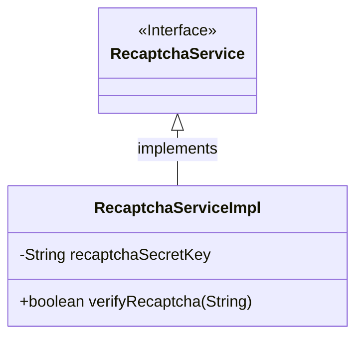

# [ 5. Class Documentation ](../documentation)

## 5.2 Business

### 5.2.2 Services

#### GameServiceImpl

Provides the core functionality to manage game-related operations, including creating, retrieving, rolling dice, and managing game states.

##### GameServiceImpl Class Diagram

##### GameServiceImpl Methods

| Method                            | Return Type    | Description                                                 |
|----------------------------------- |----------------|-------------------------------------------------------------|
| `getById(String id)`               | `Game`         | Retrieves a game by its unique identifier.                   |
| `getAll()`                         | `List<Game>`   | Retrieves all games.                                         |
| `getOrCreate(Long playerId)`       | `Game`         | Retrieves or creates a new game for the specified player.     |
| `rollById(String id, int[] dice)`  | `Game`         | Rolls the dice for the specified game.                       |
| `announceById(String id, BoxType)` | `Game`         | Announces a box type in the specified game.                  |
| `fillById(String id, ColumnType, BoxType)` | `Game`  | Fills the specified box in the specified column for the game.|
| `completeById(String id)`          | `Game`         | Completes the game by its unique identifier.                 |
| `restartById(String id)`           | `Game`         | Restarts the game by its unique identifier.                  |
| `finishById(String id)`            | `Game`         | Finishes the game by its unique identifier.                  |

---

#### PlayerServiceImpl

Handles operations related to players, including player retrieval, score management, player statistics, and player preferences.

##### PlayerServiceImpl Class Diagram

##### PlayerServiceImpl Methods

| Method                                  | Return Type              | Description                                                      |
|-----------------------------------------|--------------------------|------------------------------------------------------------------|
| `getById(Long id)`                      | `Player`                 | Retrieves a player by its unique identifier.                     |
| `getAll()`                              | `List<Player>`           | Retrieves all players.                                           |
| `getScoresByPlayerId(Long playerId)`    | `List<Score>`            | Retrieves all scores associated with a player.                   |
| `loadUserByUsername(String username)`   | `Player`                 | Loads a player by their username.                                |
| `getPlayerStats(Long playerId)`         | `PlayerStats`            | Retrieves the statistics for a player.                           |
| `getGlobalStats()`                      | `GlobalPlayerStats`      | Retrieves global statistics for all players.                     |
| `getPreferencesByPlayerId(Long playerId)`| `PlayerPreferences`      | Retrieves preferences for a player by their unique identifier.   |
| `setPreferencesByPlayerId(Long playerId, PlayerPreferences prefs)` | `PlayerPreferences` | Updates preferences for a player by their unique identifier.     |
| `changeUsername(Long playerId, String username)` | `Player`            | Changes the username for a player.                               |
| `deleteInactivePlayers()`               | `void`                   | Deletes players who have been inactive for a specified time.     |

---

#### ScoreServiceImpl

Manages score-related operations, including retrieving scores and handling global score statistics.

##### ScoreServiceImpl Class Diagram

##### ScoreServiceImpl Methods

| Method                       | Return Type         | Description                                         |
|------------------------------|---------------------|-----------------------------------------------------|
| `getById(Long id)`            | `Score`             | Retrieves a score by its unique identifier.         |
| `getAll()`                    | `List<Score>`       | Retrieves all scores.                               |
| `deleteById(Long id)`         | `void`              | Deletes a score by its unique identifier.           |
| `getGlobalStats()`            | `GlobalScoreStats`  | Retrieves global statistics for all scores.         |

---

#### LogServiceImpl

Provides functionality for creating, retrieving, and deleting logs related to player activities and game events.

##### LogServiceImpl Class Diagram

##### LogServiceImpl Methods

| Method                       | Return Type         | Description                                         |
|------------------------------|---------------------|-----------------------------------------------------|
| `getById(Long id)`            | `Log`               | Retrieves a log by its unique identifier.           |
| `getAll()`                    | `List<Log>`         | Retrieves all logs.                                 |
| `create(Log log)`             | `Log`               | Creates a new log entry.                            |
| `deleteAll()`                 | `void`              | Deletes all log entries.                            |
| `deleteById(Long id)`         | `void`              | Deletes a log by its unique identifier.             |

---

#### RecaptchaServiceImpl

Verifies Recaptcha tokens to ensure that user inputs are valid and not generated by automated systems (bots).

##### RecaptchaServiceImpl Class Diagram

##### RecaptchaServiceImpl Methods

| Method                       | Return Type         | Description                                         |
|------------------------------|---------------------|-----------------------------------------------------|
| `verifyRecaptcha(String token)` | `boolean`         | Verifies if the provided Recaptcha token is valid.  |
