# [ 5. Class Documentation ](../documentation.md)

## 5.1 Domain

### 5.1.1 Entities

| Entity              | Database Technology  | Description                                                           |
|---------------------|----------------------|-----------------------------------------------------------------------|
| **Game**            | NoSQL (MongoDB)      | Represents the game state and logic.                                  |
| **Player**          | Relational (PostgreSQL) | Abstract class representing common attributes and behavior for all player types. |
| **AnonymousPlayer** | Relational (PostgreSQL) | Subclass of `Player` representing an anonymous player without a password. |
| **RegisteredPlayer**| Relational (PostgreSQL) | Subclass of `Player` representing a registered player with a password. |
| **Role**            | Relational (PostgreSQL) | Represents the roles assigned to a player, such as admin or user.      |
| **Score**           | Relational (PostgreSQL) | Represents a score that a player earns.                               |
| **Log**             | Relational (PostgreSQL) | Represents logs created by a player during gameplay.                  |
| **PlayerPreferences**| Relational (PostgreSQL) | Represents a player's personal preferences like language and theme.    |

---

#### Game

The `Game` class represents an instance of a game session for a player, including the dice rolls, the game sheet, and the overall status of the game.

##### Game Class Diagram

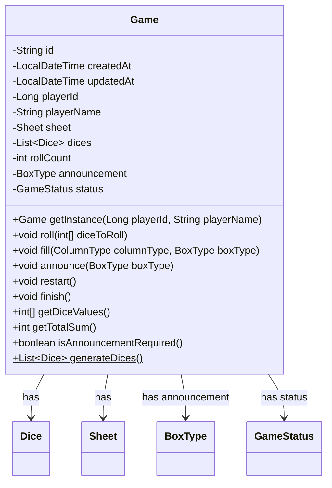

##### Game Attributes

| Attribute    | Type                     | Description                                                           |
|--------------|--------------------------|-----------------------------------------------------------------------|
| `id`         | `String`                 | Unique identifier for the game.                                        |
| `createdAt`  | `LocalDateTime`          | Timestamp indicating when the game was created.                        |
| `updatedAt`  | `LocalDateTime`          | Timestamp indicating when the game was last updated.                   |
| `playerId`   | `Long`                   | ID of the player associated with the game.                             |
| `playerName` | `String`                 | Name of the player associated with the game.                           |
| `sheet`      | `Sheet`                  | The game sheet containing score columns and boxes.                     |
| `dices`      | `List<Dice>`             | List of dice used in the game.                                         |
| `rollCount`  | `int`                    | Number of times the player has rolled the dice in the current round.   |
| `announcement`| `BoxType`               | The box type announced by the player, if any.                          |
| `status`     | `GameStatus`             | The current status of the game (e.g., IN_PROGRESS, COMPLETED).         |

##### Game Methods

| Method                                          | Return Type        | Description                                                                                   |
|-------------------------------------------------|--------------------|-----------------------------------------------------------------------------------------------|
| `getInstance(Long playerId, String playerName)` | `static Game`      | Creates and returns a new game instance for the specified player.                              |
| `roll(int[] diceToRoll)`                        | `void`             | Rolls the specified dice.                                                                     |
| `fill(ColumnType columnType, BoxType boxType)`  | `void`             | Fills the specified box in the specified column with the score based on the current dice values.|
| `announce(BoxType boxType)`                     | `void`             | Announces a specific box type.                                                                |
| `restart()`                                     | `void`             | Restarts the game by resetting dice, sheet, and roll count.                                    |
| `finish()`                                      | `void`             | Finishes the game, setting its status to FINISHED.                                             |
| `getTotalSum()`                                 | `int`              | Returns the total score for the game.                                                          |
| `isAnnouncementRequired()`                      | `boolean`          | Checks if an announcement is required based on the current game state.                         |
| `generateDices()`                               | `static List<Dice>`| Generates a new list of dice for the game.                                                     |
| `validateRollAction(int[] diceToRoll)`          | `void`             | Validates if a roll action can be performed based on the current game state.                   |
| `validatefillAction(ColumnType columnType, BoxType boxType)` | `void` | Validates if a fill action can be performed based on the current game state.                   |
| `validateAnnouncementAction(BoxType boxType)`   | `void`             | Validates if an announcement can be made based on the current game state.                      |
| `validateRestartAction()`                       | `void`             | Validates if the game can be restarted.                                                        |
| `validateFinishAction()`                        | `void`             | Validates if the game can be finished.                                                         |
| `isBoxAvailable(ColumnType columnType, BoxType boxType)` | `boolean` | Checks if a box is available for filling based on the game state and rules.                    |

---

#### Dice

The `Dice` class represents an individual die used in the game, containing attributes such as the die's index and current value, and methods for rolling the die.

##### Dice Class Diagram

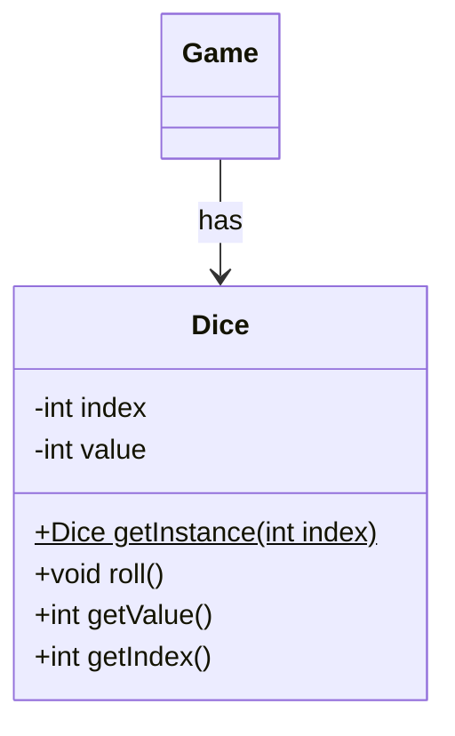

##### Dice Attributes

| Attribute | Type    | Description                       |
|-----------|---------|-----------------------------------|
| `index`   | `int`   | Index of the dice in the list.     |
| `value`   | `int`   | Current value of the dice.         |

##### Dice Methods

| Method                | Return Type | Description                            |
|-----------------------|-------------|----------------------------------------|
| `getInstance(int index)` | `static Dice` | Creates and returns a new dice instance with the specified index. |
| `roll()`              | `void`      | Rolls the dice, generating a random value between 1 and 6.         |

---

#### Sheet

The `Sheet` class represents the game sheet that holds multiple columns, each of which contains boxes for scoring different sections of the game (top, middle, bottom). It provides methods for calculating scores and determining if the sheet is complete.

##### Sheet Class Diagram

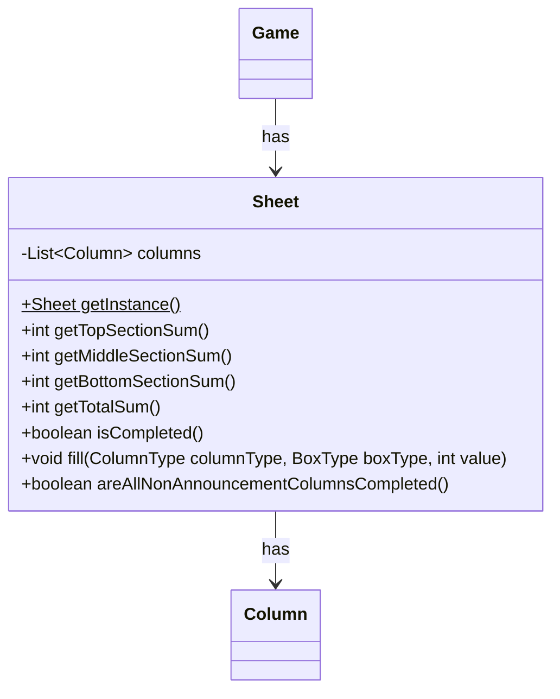

##### Sheet Attributes

| Attribute | Type             | Description                             |
|-----------|------------------|-----------------------------------------|
| `columns` | `List<Column>`    | List of columns representing the game sheet. |

##### Sheet Methods

| Method                                  | Return Type  | Description                                                                 |
|-----------------------------------------|--------------|-----------------------------------------------------------------------------|
| `getInstance()`                         | `static Sheet`| Creates and returns a new instance of the sheet with generated columns.      |
| `getTopSectionSum()`                    | `int`        | Calculates and returns the sum of the top section.                           |
| `getMiddleSectionSum()`                 | `int`        | Calculates and returns the sum of the middle section.                        |
| `getBottomSectionSum()`                 | `int`        | Calculates and returns the sum of the bottom section.                        |
| `getTotalSum()`                         | `int`        | Returns the total score of all sections combined.                            |
| `isCompleted()`                         | `boolean`    | Checks if the entire sheet has been filled.                                  |
| `fill(ColumnType columnType, BoxType boxType, int value)` | `void` | Fills a specific box in the sheet with the given value.                      |
| `areAllNonAnnouncementColumnsCompleted()` | `boolean`  | Checks if all non-announcement columns are completed.                        |

---

#### Column

The `Column` class represents a column within the game sheet. Each column contains multiple boxes for different scoring categories, and methods to calculate sums for sections of the column.

##### Column Class Diagram

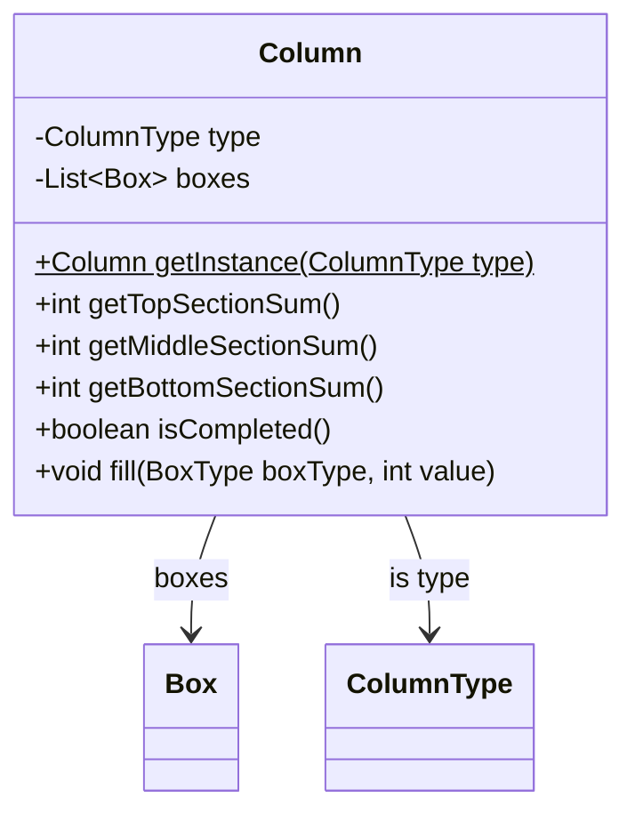

##### Column Attributes

| Attribute | Type          | Description                        |
|-----------|---------------|------------------------------------|
| `type`    | `ColumnType`  | Type of the column (e.g., DOWNWARDS, UPWARDS). |
| `boxes`   | `List<Box>`   | List of boxes associated with the column. |

##### Column Methods

| Method                               | Return Type   | Description                                                                 |
|--------------------------------------|---------------|-----------------------------------------------------------------------------|
| `getInstance(ColumnType type)`       | `static Column`| Creates and returns a new column instance with the specified type.           |
| `getTopSectionSum()`                 | `int`         | Calculates and returns the sum of the top section of the column.             |
| `getMiddleSectionSum()`              | `int`         | Calculates and returns the sum of the middle section of the column.          |
| `getBottomSectionSum()`              | `int`         | Calculates and returns the sum of the bottom section of the column.          |
| `isCompleted()`                      | `boolean`     | Checks if the entire column has been filled.                                 |
| `fill(BoxType boxType, int value)`   | `void`        | Fills the specified box in the column with the provided value.               |

---

#### Box 

The `Box` class represents an individual scoring box in a column, holding a specific type (e.g., ONES, YAMB) and value, and providing methods to fill it with a score.

##### Box Class Diagram

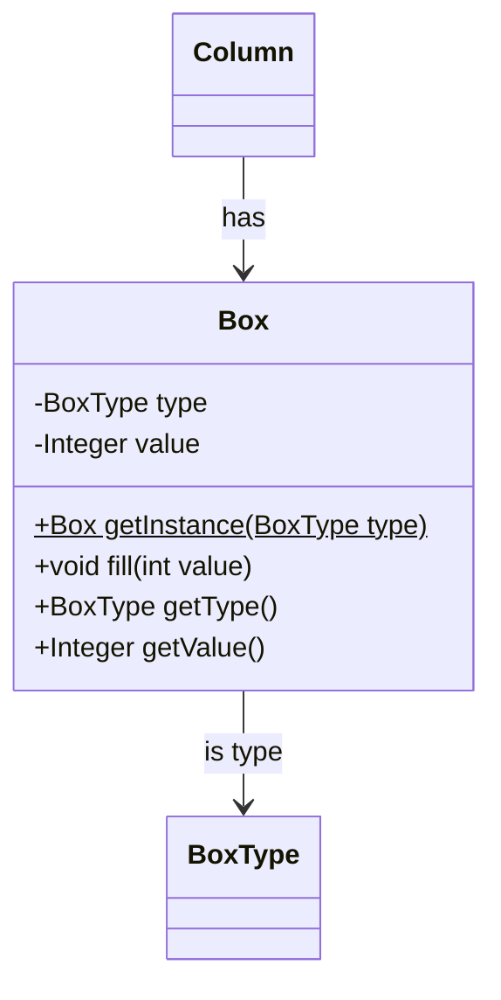

##### Box Attributes

| Attribute | Type      | Description                         |
|-----------|-----------|-------------------------------------|
| `type`    | `BoxType` | Type of the box (e.g., ONES, YAMB).  |
| `value`   | `Integer` | Value currently stored in the box.   |

##### Box Methods

| Method                       | Return Type  | Description                                                           |
|------------------------------|--------------|-----------------------------------------------------------------------|
| `getInstance(BoxType type)`   | `static Box` | Creates and returns a new box instance of the specified type.          |
| `fill(int value)`             | `void`       | Fills the box with the specified value.                                |

---

#### Player

The `Player` class defines common attributes and methods shared by all players in the system. This class is abstract, meaning it cannot be instantiated directly.

##### Player Class Diagram

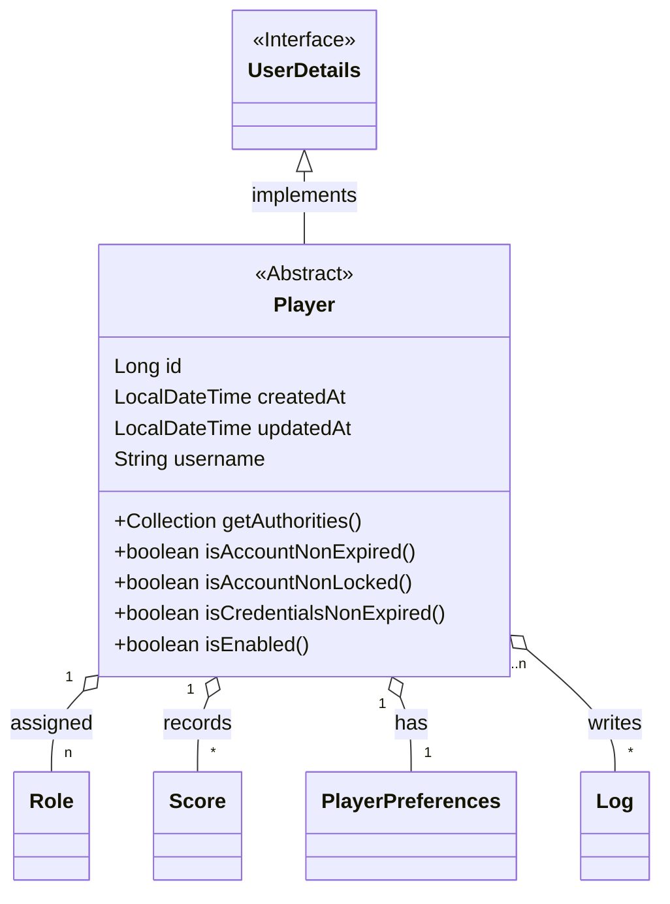

##### Player Attributes

| Attribute      | Type            | Description                                           |
|----------------|-----------------|-------------------------------------------------------|
| `id`           | Long            | Unique identifier for the player.                     |
| `createdAt`    | LocalDateTime    | Timestamp when the player was created.                |
| `updatedAt`    | LocalDateTime    | Timestamp when the player was last updated.           |
| `username`     | String          | The player's username.       

##### Player Methods

| Method                        | Return Type                   | Description                                                                 |
|-------------------------------|-------------------------------|-----------------------------------------------------------------------------|
| `getAuthorities()`             | Collection\<GrantedAuthority\> | Returns the authorities granted to the player (e.g., roles, permissions).   |
| `isAccountNonExpired()`        | boolean                       | Indicates whether the player's account is expired.                          |
| `isAccountNonLocked()`         | boolean                       | Indicates whether the player's account is locked.                           |
| `isCredentialsNonExpired()`    | boolean                       | Indicates whether the player's credentials (password) are expired.          |
| `isEnabled()`                  | boolean                       | Indicates whether the player is enabled (active).                           |

---

#### AnonymousPlayer

The `AnonymousPlayer` class extends `Player` and represents an anonymous player. This type of player does not have a password.

##### AnonymousPlayer Class Diagram
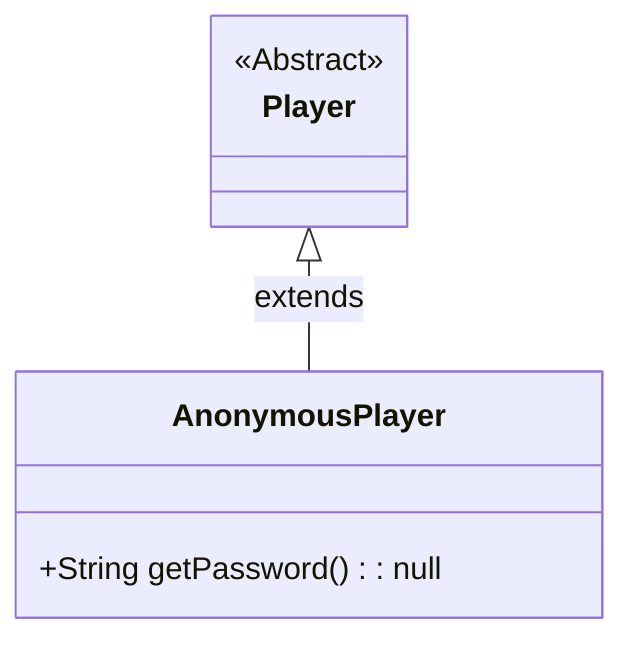

##### AnonymousPlayer Methods

| Method                        | Return Type | Description                                             |
|-------------------------------|-------------|---------------------------------------------------------|
| `getPassword()`                | String      | Returns `null` since anonymous players have no password. |

---

##### RegisteredPlayer

The `RegisteredPlayer` class extends `Player` and represents a registered player with a password.

##### RegisteredPlayer Class Diagram

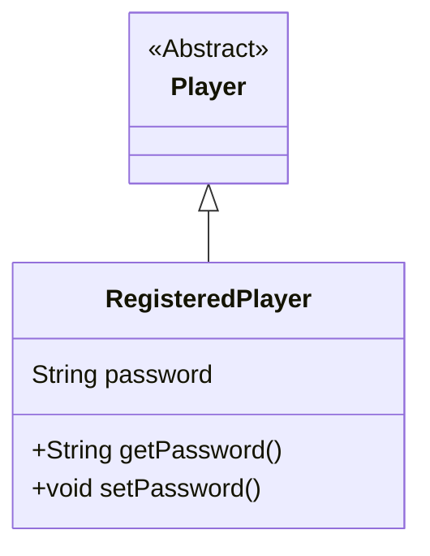

##### RegisteredPlayer Attributes

| Attribute      | Type   | Description                   |
|----------------|--------|-------------------------------|
| `password`     | String | The password for the player.   |

##### RegisteredPlayer Methods

| Method                        | Return Type | Description                                                 |
|-------------------------------|-------------|-------------------------------------------------------------|
| `getPassword()`                | String      | Returns the player's password.                              |
| `setPassword(String password)` | void        | Sets the player's password.                                 |

---

#### Score

The `Score` class represents a score earned by a player.

##### Score Class Diagram

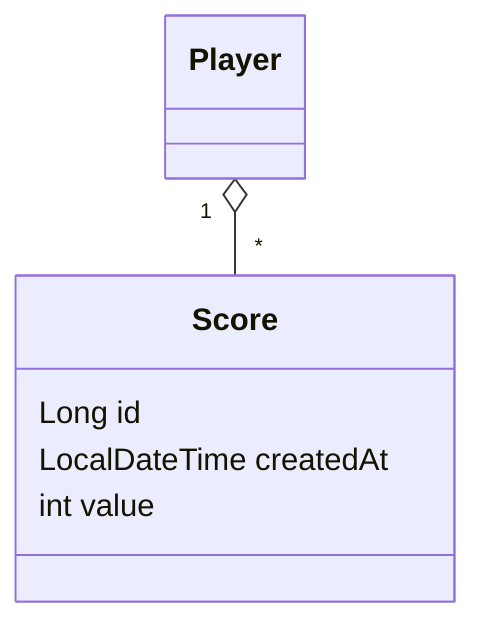

##### Score Attributes

| Attribute      | Type           | Description                              |
|----------------|----------------|------------------------------------------|
| `id`           | Long           | Unique identifier for the score.         |
| `createdAt`    | LocalDateTime   | Timestamp when the score was created.    |
| `value`        | int            | The value of the score.                  |

---

#### Log

The `Log` class represents logs generated by players during gameplay.

##### Log Class Diagram

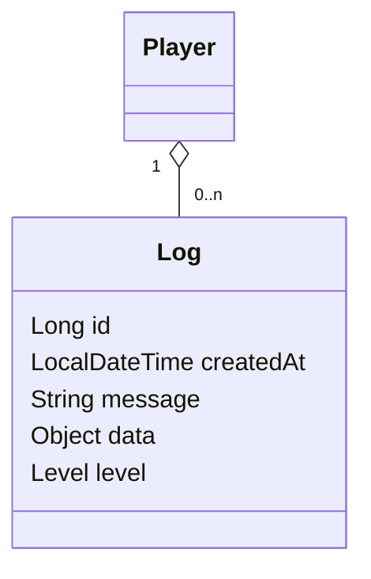

##### Log Attributes

| Attribute      | Type           | Description                                  |
|----------------|----------------|----------------------------------------------|
| `id`           | Long           | Unique identifier for the log entry.         |
| `createdAt`    | LocalDateTime   | Timestamp when the log entry was created.    |
| `message`      | String          | The message of the log.                      |
| `data`         | Object          | Optional additional data associated with the log. |
| `level`        | Level           | The level of the log (e.g., INFO, ERROR).    |

---

#### Role

The `Role` class represents a role assigned to a player. Each player can have multiple roles.

##### Role Class Diagram

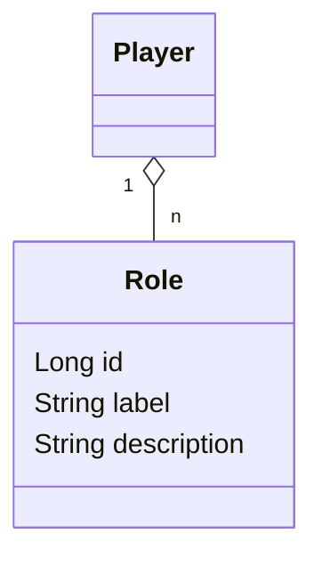

##### Role Attributes

| Attribute      | Type   | Description               |
|----------------|--------|---------------------------|
| `id`           | Long   | Unique identifier for the role. |
| `label`        | String | The label of the role (e.g., "ADMIN", "USER"). |
| `description`  | String | A brief description of the role. |

---

#### PlayerPreferences

The `PlayerPreferences` class represents a player's preferences such as theme and language.

##### PlayerPreferences Class Diagram

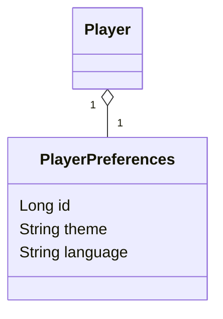
##### PlayerPreferences Attributes

| Attribute      | Type   | Description                           |
|----------------|--------|---------------------------------------|
| `id`           | Long   | Unique identifier for the preferences.|
| `theme`        | String | The player's chosen theme (e.g., dark, light). |
| `language`     | String | The player's preferred language.      |

---

### Entity-Relationship Diagram

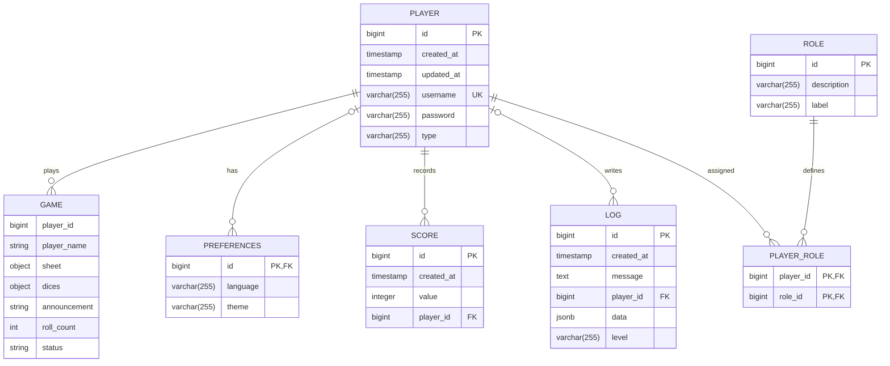