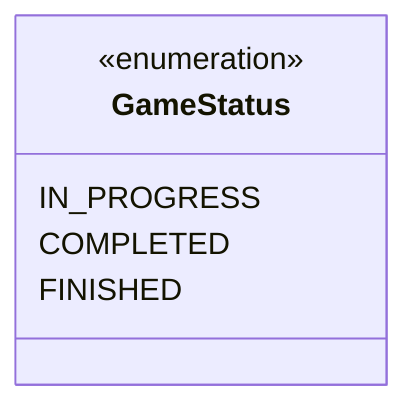
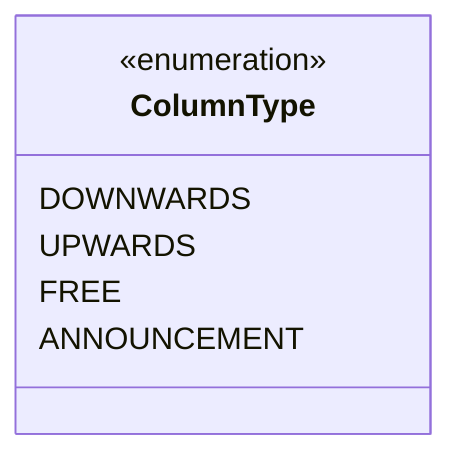
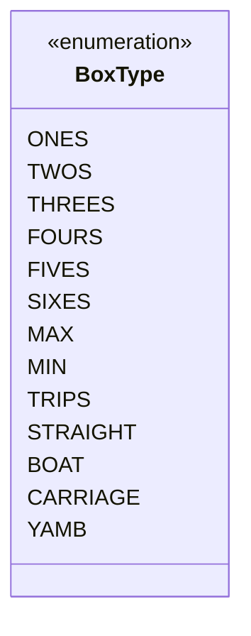

# [ 5. Class Documentation ](../documentation)

## 5.1 Domain

### 5.1.2 Enums

These enums define various aspects of the game, including game status, box types and column types.

#### GameStatus

The `GameStatus` enum represents the current state of the game. This is used to determine whether the game is still in progress, completed, or finished.

##### GameStatus Class Diagram

##### GameStatus Values

| Enum Value      | Description                                                                                                                                       |
|-----------------|---------------------------------------------------------------------------------------------------------------------------------------------------|
| `IN_PROGRESS`   | Represents the state when the game is active and currently being played. The user is still making moves, and the game isn't over yet.             |
| `COMPLETED`     | Represents the state when the game has been fully played, and all boxes have been filled. The game is over, and the final score can be calculated. |
| `FINISHED`      | Represents the state when the user has started a new game, retiring the old game. The old game is considered finished, and no further actions are taken. |

---

#### ColumnType

The `ColumnType` enum defines the types of columns available in the game. Each column has its own set of rules that affect how the player can fill boxes.

##### ColumnType Class Diagram

##### ColumnType Values

| Enum Value      | Description                                                                       |
|-----------------|-----------------------------------------------------------------------------------|
| `DOWNWARDS`     | The player must fill boxes from top to bottom.                                    |
| `UPWARDS`       | The player must fill boxes from bottom to top.                                    |
| `FREE`          | The player can fill any box in any order.                                         |
| `ANNOUNCEMENT`  | The player must announce in advance which box they will fill after the first roll.|

---

#### BoxType

The `BoxType` enum represents different categories in the game that a player can score points in. It is divided into three main sections: Top, Middle, and Bottom.

##### BoxType Class Diagram

##### BoxType Values

| Enum Value | Section       | Description                                         |
|------------|---------------|-----------------------------------------------------|
| `ONES`     | Top Section   | Represents the dice value "1"                       |
| `TWOS`     | Top Section   | Represents the dice value "2"                       |
| `THREES`   | Top Section   | Represents the dice value "3"                       |
| `FOURS`    | Top Section   | Represents the dice value "4"                       |
| `FIVES`    | Top Section   | Represents the dice value "5"                       |
| `SIXES`    | Top Section   | Represents the dice value "6"                       |
| `MAX`      | Middle Section| Represents the maximum possible dice sum            |
| `MIN`      | Middle Section| Represents the minimum possible dice sum            |
| `TRIPS`    | Bottom Section| Represents a combination of three-of-a-kind         |
| `STRAIGHT` | Bottom Section| Represents a straight (5 sequential dice values)    |
| `BOAT`     | Bottom Section| Represents a full house (3+2 of one kind)           |
| `CARRIAGE` | Bottom Section| Represents a combination of four-of-a-kind          |
| `YAMB`     | Bottom Section| Represents a combination of five-of-a-kind          |