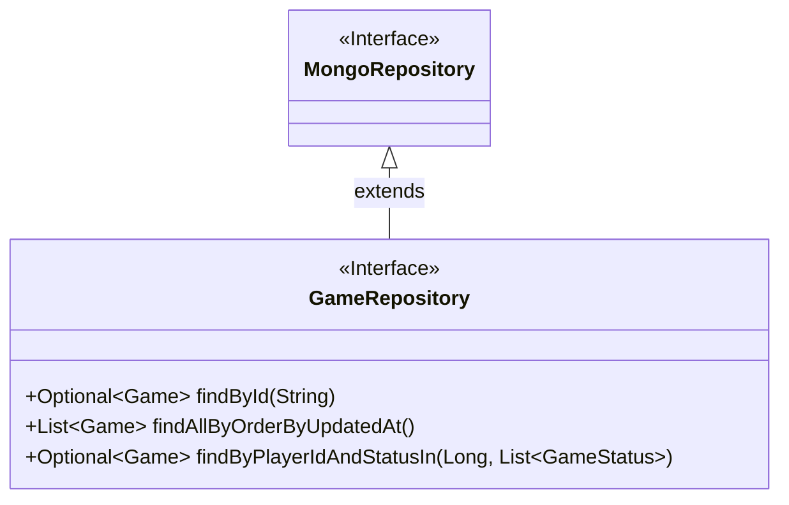
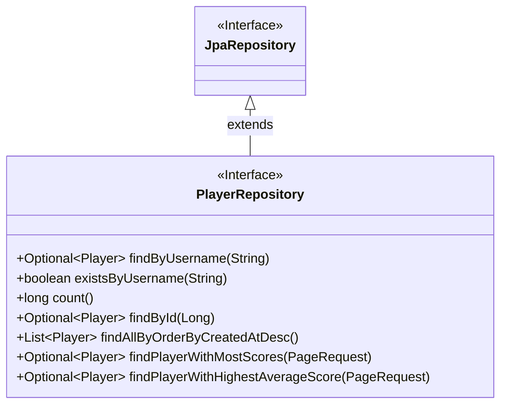
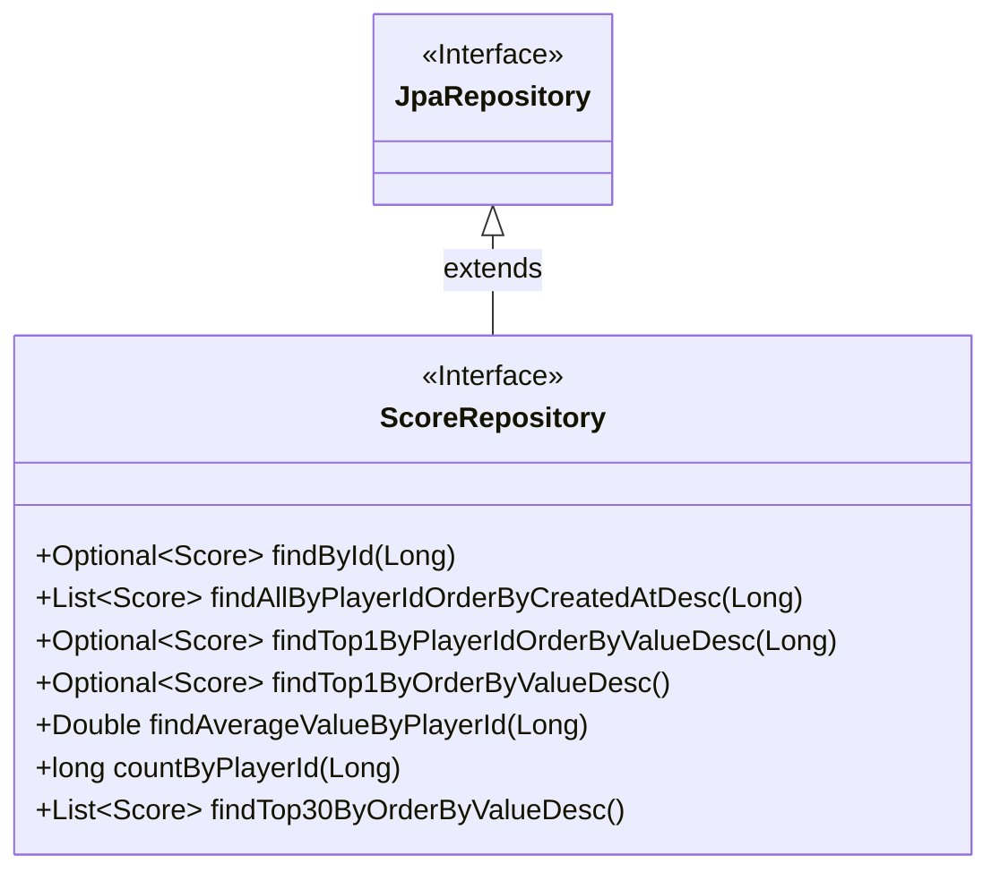
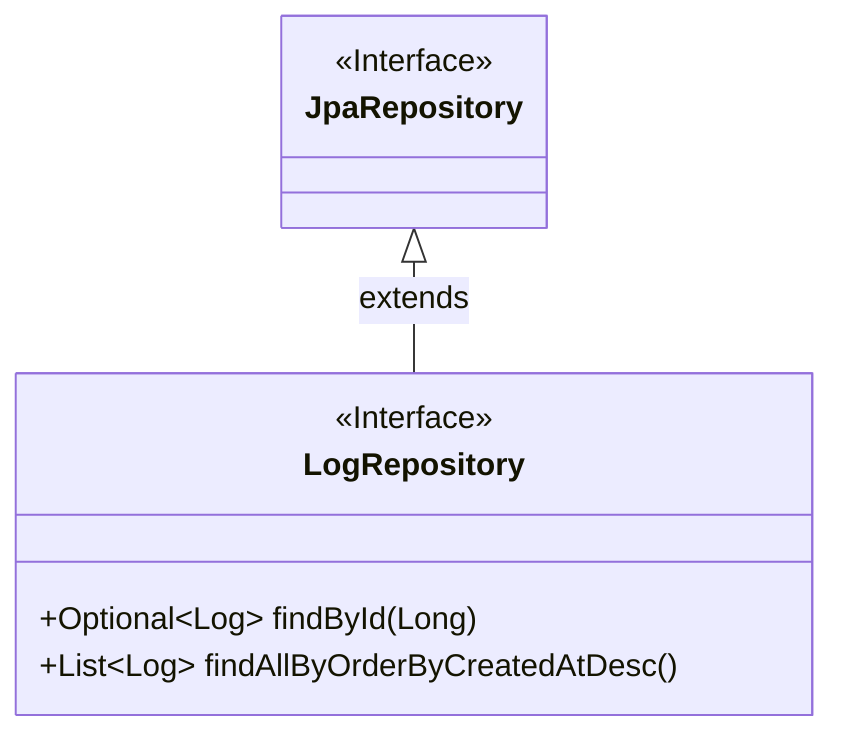

# [ 5. Class Documentation ](../documentation.md)

## 5.1 Domain

### 5.1.3 Repositories

In the Domain of the application, repositories are responsible for interacting with the data store (PostgreSQL or MongoDB). Repositories abstract the underlying database interactions by providing methods to query, retrieve, save, and manage domain entities such as `Player`, `Game`, `Score`, and `Log`.

Repositories extend Spring Data’s `JpaRepository` or `MongoRepository` interfaces, which provide default methods such as `save()`, `findById()`, and `delete()`. Additional custom queries are also defined to meet the specific needs of the application.

#### GameRepository

Manages the persistence of Game entities, which are stored in MongoDB. This repository focuses on storing and retrieving active, completed, or in-progress games.

##### GameRepository Class Diagram

##### GameRepository Methods

| Method                                         | Return Type              | Description                                                                                   |
|------------------------------------------------|--------------------------|-----------------------------------------------------------------------------------------------|
| `findById(String id)`                          | `Game`                   | Finds a game by its unique ID.                                                                 |
| `findAllByOrderByUpdatedAt()`                  | `List<Game>`             | Retrieves all games ordered by their last updated timestamp (most recent first).               |
| `findByPlayerIdAndStatusIn(Long playerId, List<GameStatus> statuses)` | `List<Game>` | Finds games by a player's ID and specific game statuses (e.g., in-progress, completed).        |

---

#### PlayerRepository

Handles CRUD (Create, Read, Update, Delete) operations related to the `Player` entity. Interacts with relational data for player registration, authentication, and profile management.

##### PlayerRepository Methods

| Method                                         | Return Type              | Description                                                                                   |
|------------------------------------------------|--------------------------|-----------------------------------------------------------------------------------------------|
| `findByUsername(String username)`              | `Player`                 | Finds a player by their unique username. Useful for login or fetching player details.          |
| `existsByUsername(String username)`            | `boolean`                | Checks if a username is already taken. Useful during registration.                            |
| `count()`                                      | `long`                   | Returns the total number of players in the system.                                             |
| `findById(Long id)`                            | `Player`                 | Retrieves a player by their unique ID.                                                         |
| `findAllByOrderByCreatedAtDesc()`              | `List<Player>`           | Fetches a list of all players ordered by their creation date (newest first).                   |
| `findPlayerWithMostScores(PageRequest pageRequest)` | `Player`              | Retrieves the player with the most scores.                                                     |
| `findPlayerWithHighestAverageScore(PageRequest pageRequest)` | `Player`         | Retrieves the player with the highest average score.                                           |

##### PlayerRepository Class Diagram

---

#### ScoreRepository

Handles CRUD operations for Score entities, which record the results of completed games. Scores are tied to players and are used for generating statistics.

##### ScoreRepository Class Diagram

##### ScoreRepository Methods

| Method                                         | Return Type              | Description                                                                                   |
|------------------------------------------------|--------------------------|-----------------------------------------------------------------------------------------------|
| `findById(Long id)`                            | `Score`                  | Retrieves a score by its unique ID.                                                            |
| `findAllByPlayerIdOrderByCreatedAtDesc(Long playerId)` | `List<Score>`         | Retrieves all scores for a player, ordered by the creation date (newest first).                |
| `findTop1ByPlayerIdOrderByValueDesc(Long playerId)` | `Score`              | Finds the highest score for a player.                                                         |
| `findTop1ByOrderByValueDesc()`                 | `Score`                  | Finds the highest score across all players.                                                    |
| `findAverageValueByPlayerId(Long playerId)`    | `double`                 | Retrieves the average score for a player.                                                      |
| `countByPlayerId(Long playerId)`               | `long`                   | Counts the total number of scores for a player.                                                |
| `findTop30ByOrderByValueDesc()`                | `List<Score>`            | Retrieves the top 30 scores across all players for generating leaderboards.                    |

---

#### LogRepository

Manages the persistence of system logs, which can be generated for player actions, system events, or errors. This repository is backed by PostgreSQL and is mostly accessed by admins.

##### LogRepository Class Diagram

##### LogRepository Methods

| Method                                         | Return Type              | Description                                                                                   |
|------------------------------------------------|--------------------------|-----------------------------------------------------------------------------------------------|
| `findById(Long id)`                            | `Log`                    | Retrieves a specific log entry by its unique ID.                                               |
| `findAllByOrderByCreatedAtDesc()`              | `List<Log>`              | Fetches all logs ordered by their creation date (newest first). Useful for viewing recent events.|
